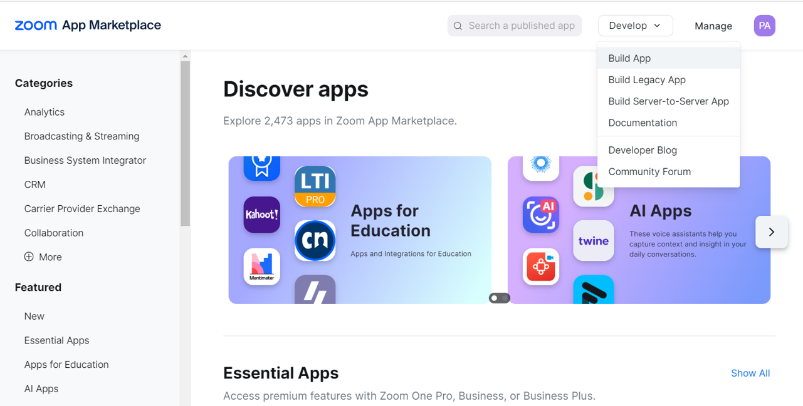
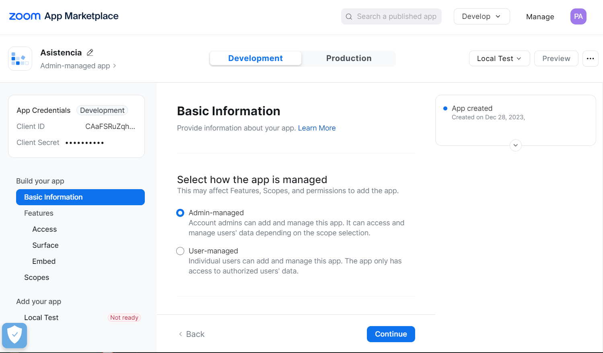
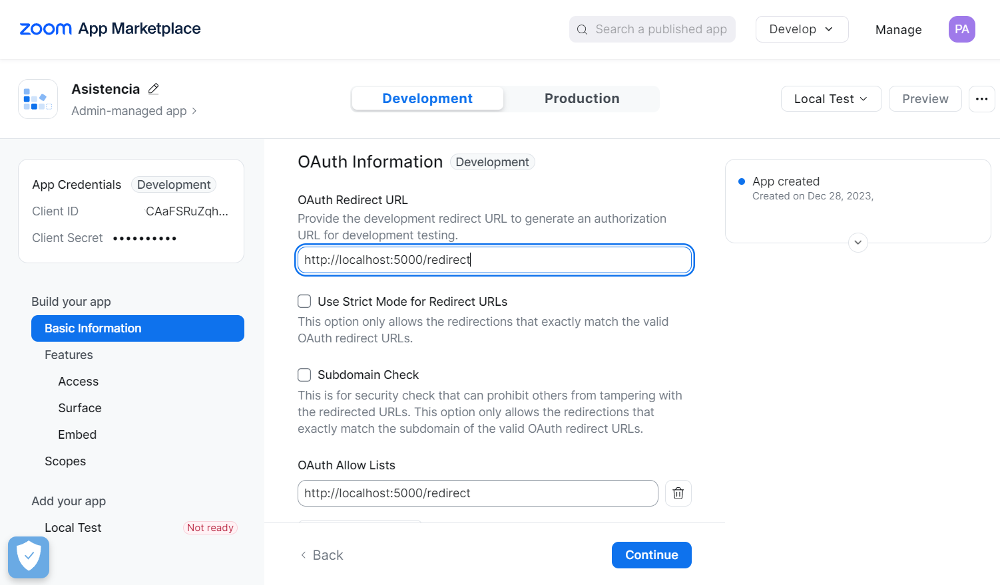
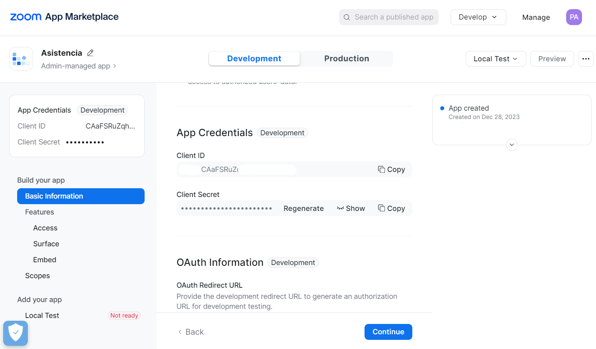
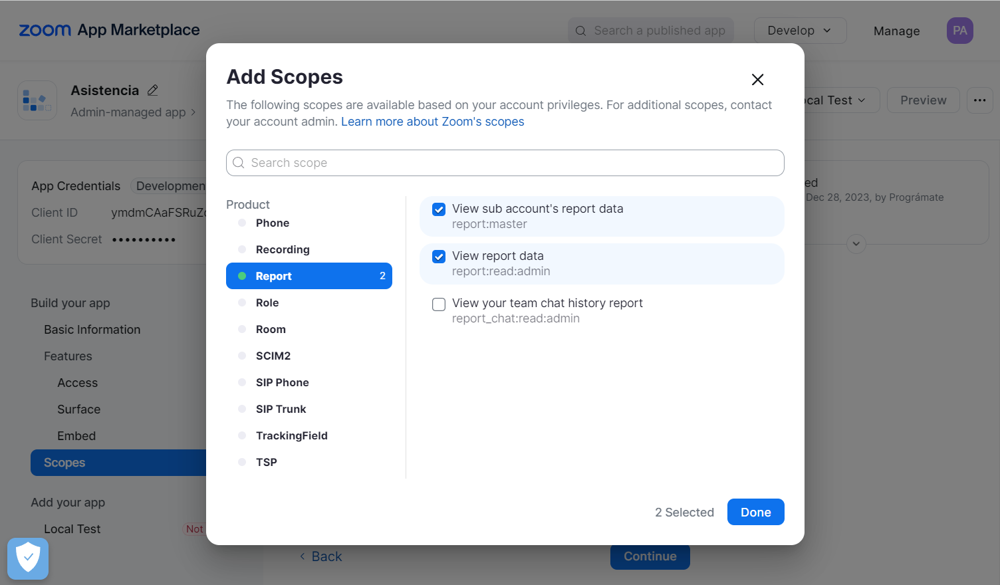
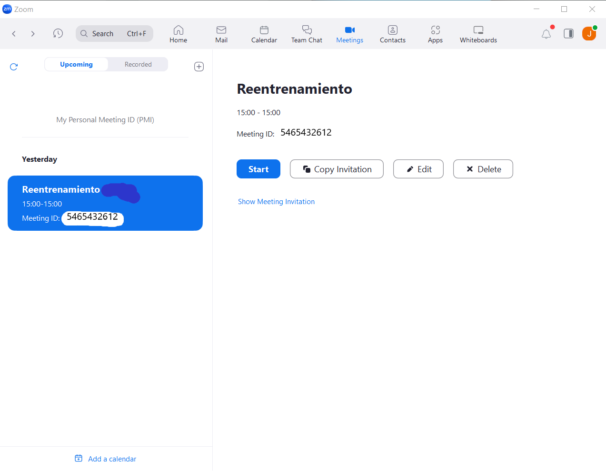
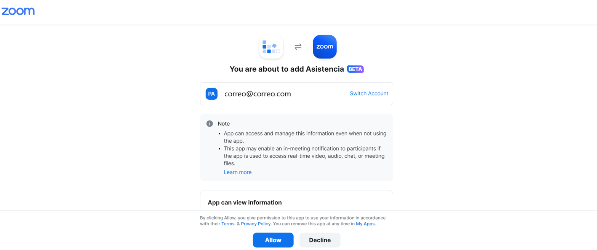

# Proyecto Flask de Asistencia a Reuniones Zoom

Este proyecto utiliza Flask para interactuar con la API de Zoom y obtener la lista de participantes en una reunión.

## Requisitos Previos

Asegúrate de tener instalado Python y pip. Además, se recomienda utilizar un entorno virtual para gestionar las dependencias del proyecto.

## Clonar el Repositorio

```bash
git clone https://github.com/JymmyMurillo/Conexion_Zoom_API.git

cd Conexion_Zoom_API
```

## Instalación de Dependencias
```bash
pip install -r requirements.txt
```

## Configuración de Variables de Entorno
Crea un archivo .env en el directorio raíz del proyecto y configura las variables de entorno necesarias. Puedes usar el archivo .env.example como base.

```bash
# Flask Configuration
FLASK_SECRET_KEY=YourSecretKeyExample #You define it randomly

# Zoom OAuth Configuration
ZOOM_CLIENT_ID=YourZoomClientIdExample #Extracted from the zoom Marketplace app
ZOOM_CLIENT_SECRET=YourZoomClientSecretExample #Extracted from the zoom Marketplace app
ZOOM_REDIRECT_URI=http://localhost:5000/redirect #You can leave this same value, it corresponds to the port where the application will be executed
ZOOM_MEETING_ID=YourZoomMeetingIdExample #Corresponds to the ID of the meeting to be reviewed, it must be changed each time a new meeting is created.
```
### - Tendras que acceder a tu cuenta en zoom para obtener las credenciales:
### Ingreso a Zoom y Creación de Aplicación OAuth

#### Paso 1: Ingreso a Zoom

1. Abre tu navegador web y ve a [Zoom](https://zoom.us/).
2. Inicia sesión en tu cuenta de Zoom o crea una nueva si aún no tienes una.

#### Paso 2: Creación de Aplicación OAuth

1. Accede al [Centro de Desarrolladores de Zoom](https://marketplace.zoom.us/develop).
2. Haz clic en "Iniciar sesión" y utiliza tu cuenta de Zoom para iniciar sesión en el Centro de Desarrolladores.
3. En el panel de control del desarrollador, haz clic en "Crear App" en la esquina superior derecha.




4. Completa la información básica de la aplicación, incluyendo el nombre y la descripción.



5. En la sección "Feature", selecciona "OAuth" como el tipo de autenticación.

6. En la sección "Redirect URL for OAuth", ingresa la URL de redirección que configuraste en tu aplicación Flask (por ejemplo, http://localhost:5000/redirect).



8. Haz clic en "Guardar/Continuar".

#### Paso 3: Obtención de Credenciales

1. En la página de detalles de la aplicación, encontrarás tu "Client ID" y "Client Secret". Copia estos valores, ya que los necesitarás para configurar tu aplicación Flask en el archico .env.



2. Agregas en la seccion scopes, la informacion que permitiras compartir a traves de la aplicacion, para este caso, solo queremos reportes.



#### Paso 4: Obtención de Credenciales de Reunión
1. En la app de zoom, crea una reunion.
2. Extrae el Meeting ID y reemplazalo en su respectiva variable de entorno.



## Inicialización del Proyecto
```bash
python index.py
```
La aplicación se ejecutará en http://localhost:5000/. Abre tu navegador y accede a esta URL para iniciar sesión con Zoom.

## Uso
1. Haz clic en "Iniciar sesión con Zoom" en la página principal.

2. Autoriza la aplicación en la página de autenticación de Zoom.
    
3. Serás redirigido de nuevo a la aplicación, donde se mostrará la información de los participantes.

